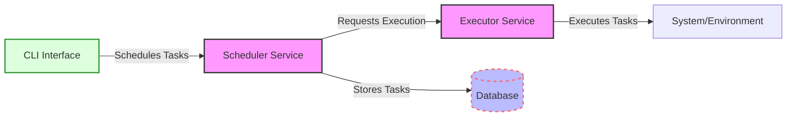

# Local Task Scheduler and Executor

## Overview
The Local Task Scheduler and Executor is backend system engineered to define, schedule, and execute tasks with precision and reliability. Emphasizing security and efficient inter-service communication via gRPC, the system provides a command-line interface (CLI) for comprehensive task management.

## Features
- **Task Scheduling**: Ability to schedule tasks with specific commands and execution times.
- **Task Execution**: Executes scheduled tasks, ensuring concurrent execution handling.
- **Security**: Incorporates basic encryption for task data and secures gRPC communication.
- **CLI**: A user-friendly command-line interface for seamless task management.

## Getting Started

### Prerequisites
- Python 3.12+
- Poetry for dependency management

### Installation
1. Clone the repository and navigate to the project directory:
   ```shell
   git clone https://github.com/cheickmec/local-task-scheduler.git
   cd local-task-scheduler
   ```
2. Install dependencies using Poetry:
   ```shell
   poetry install
   ```
3. Generate Python classes from Protobuf definitions:
```shell
   poetry run python -m grpc_tools.protoc \
  -I./local_task_scheduler/grpc_services/protobufs \
  --python_out=./local_task_scheduler/grpc_services/grpc_types \
  --pyi_out=./local_task_scheduler/grpc_services/grpc_types \
  --grpc_python_out=./local_task_scheduler/grpc_services/grpc_types \
  ./local_task_scheduler/grpc_services/protobufs/*.proto
```

### Testing the Application
Run all tests with the following command:
```shell
poetry run pytest tests
```

### Running the Application
- To start Executor service:
  ```shell
  poetry run python main.py
  ```

## Usage
Interact with the system using the CLI. Here are some common commands:

- **Schedule a Task**:
  ```shell
  poetry run python local_task_scheduler/cli/command_line_interface.py schedule --id "task1" --command "echo Hello World"
  ```
- **List Tasks**:
  ```shell
  poetry run python local_task_scheduler/cli/command_line_interface.py list
  ```
- **Modify a Task**:
  ```shell
  poetry run python local_task_scheduler/cli/command_line_interface.py modify --id "task1" --command "echo Updated Command"
  ```
- **Delete a Task**:
  ```shell
  poetry run python local_task_scheduler/cli/command_line_interface.py delete --id "task1"
  ```

## Development
Developers should familiarize themselves with the project structure and adhere to the coding standards outlined below.

### Project Structure
The project is organized into several key directories:
- `cli/`: Contains CLI interface code.
- `scheduler/`: Scheduler service implementation.
- `executor/`: Executor service implementation.
- `protobufs/`: Protobuf definitions for gRPC communication.
- `tests/`: Test cases for all components.

### Coding Standards
- Adhere to [PEP 8](https://www.python.org/dev/peps/pep-0008/) style guidelines.
- Use type hints as per [PEP 484](https://www.python.org/dev/peps/pep-0484/).
- Ensure comprehensive testing for new features or bug fixes.

## Contributing
Contributions are welcome! Please refer to [our contributing guidelines](CONTRIBUTING.md) for more information on how to participate.

## License
This project is licensed under the MIT License - see the [LICENSE](LICENSE) file for details.
